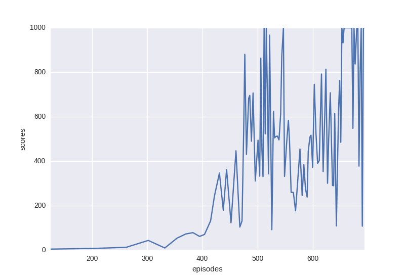
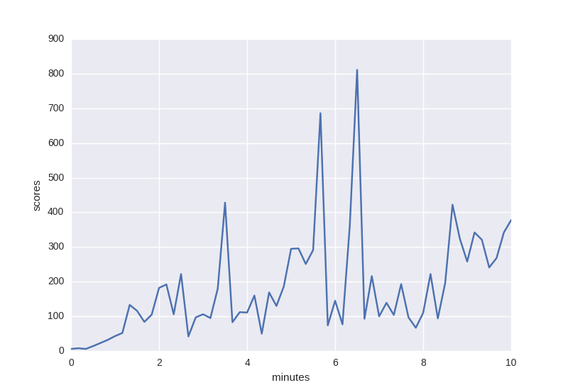

# Pytorch-DPPO
Pytorch implementation of Distributed Proximal Policy Optimization: https://arxiv.org/abs/1707.02286
Using PPO with clip loss (from https://arxiv.org/pdf/1707.06347.pdf).

Progress of single PPO with InvertedPendulum-v1:

Progress of DPPO (4 agents) with InvertedPendulum-v1:

It seems that synchronous updates with 4 agents is slower than a simple single PPO. This is maybe because of a bad choice of hyperparameters in the multi-agent case.

## Acknowledgments
The structure of this code is based on https://github.com/ikostrikov/pytorch-a3c.

Hyperparameters and loss computation has been taken from https://github.com/openai/baselines
