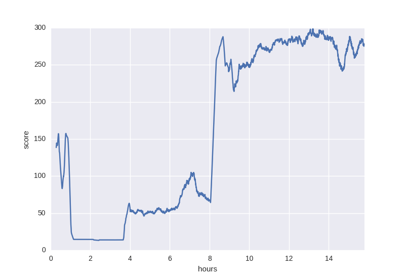

# Pytorch-DPPO
Pytorch implementation of Distributed Proximal Policy Optimization: https://arxiv.org/abs/1707.02286
Using PPO with clip loss (from https://arxiv.org/pdf/1707.06347.pdf). 
Seems to work with InvertedPendulum-v1 and Hopper-v1.

Progress with InvertedPendulum-v1:

Progress with Hopper-v1:

But this implementation is still quite slow comparing to impressive performances displayed in the paper.

## Acknowledgments
The structure of this code is based on https://github.com/ikostrikov/pytorch-a3c.

Hyperparameters and loss computation has been taken from https://github.com/openai/baselines
